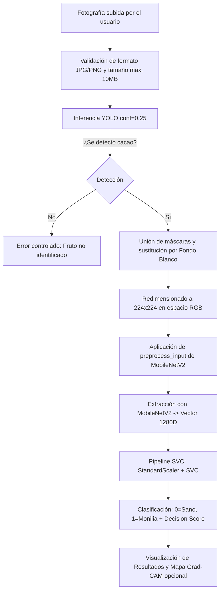

# MoniDetect 🌱🍫

**Detección inteligente de moniliasis (*Moniliophthora roreri*) en frutos de cacao mediante visión artificial y aprendizaje automático.**

MoniDetect es una aplicación web profesional desarrollada en **Django** diseñada para el diagnóstico fitosanitario preventivo en el cultivo de cacao. La aplicación integra un flujo modular de inferencia en memoria compuesto por segmentación de instancias con **YOLO**, extracción de características de alta dimensionalidad con **MobileNetV2** y clasificación robusta mediante un pipeline con **Support Vector Classifier (SVC)**, además de visualización interpretativa con **Grad-CAM**.

---

## 📋 Estructura del Proyecto

```text
MoniDetect/
├── .venv/                         # Entorno virtual de Python
├── .gitignore                     # Reglas de exclusión para Git
├── requirements.txt               # Dependencias del proyecto
├── README.md                      # Documentación y guía de uso
├── manage.py                      # Utilidad de administración de Django
├── models/                        # Directorio para los artefactos de IA
│   └── README_MODELS.txt          # Instrucciones para la colocación de modelos
├── monidetect/                    # Configuración principal del proyecto
│   ├── __init__.py
│   ├── settings.py                # Ajustes de Django, seguridad y rutas
│   ├── urls.py                    # Enrutamiento principal
│   ├── wsgi.py                    # Interfaz WSGI
│   └── asgi.py                    # Interfaz ASGI
└── diagnosis/                     # Módulo de diagnóstico e inferencia
    ├── __init__.py
    ├── apps.py
    ├── forms.py                   # Validación de imágenes y opciones
    ├── urls.py                    # Rutas web y endpoints API
    ├── views.py                   # Controladores HTTP y respuestas JSON
    ├── services/                  # Capa de servicios desacoplada
    │   ├── __init__.py
    │   ├── model_service.py       # Carga centralizada y caché de modelos
    │   ├── image_service.py       # Segmentación YOLO, fondo blanco y preprocesamiento
    │   ├── inference_service.py   # Orquestador del pipeline predict_cacao()
    │   └── gradcam_service.py     # Mapas de activación CNN Grad-CAM
    ├── templates/
    │   └── diagnosis/
    │       ├── base.html          # Plantilla base con diseño y navegación
    │       └── index.html         # Panel principal de carga y resultados
    └── static/
        └── diagnosis/
            ├── css/
            │   └── styles.css     # Sistema de diseño moderno y responsive
            └── js/
                └── main.js        # Drag & drop, preview y llamadas AJAX
```

---

## ⚙️ 1. Creación y Activación del Entorno Virtual

El proyecto ya cuenta con el directorio `.venv` configurado. Para activarlo desde tu terminal:

### En Windows (PowerShell):
```powershell
.\.venv\Scripts\Activate.ps1
```

*(Si PowerShell restringe la ejecución de scripts, puedes habilitarlo en tu sesión con `Set-ExecutionPolicy -Scope Process -ExecutionPolicy Bypass`)*

### En Windows (CMD):
```cmd
.\.venv\Scripts\activate.bat
```

### En Linux / macOS:
```bash
source .venv/bin/activate
```

---

## 📦 2. Instalación de Dependencias

Con el entorno virtual activado, instala los paquetes requeridos:

```bash
pip install --upgrade pip
pip install -r requirements.txt
```

### Dependencias Principales:
- **Django**: Framework web robusto y seguro.
- **ultralytics**: Inferencia y segmentación de frutos con YOLO.
- **tensorflow**: Extracción de características y CNN MobileNetV2.
- **scikit-learn & joblib**: Pipeline de escalado y clasificación SVC.
- **Pillow & opencv-python-headless**: Procesamiento y manipulación de imágenes.
- **numpy**: Operaciones matriciales y tensores.

---

## 🗄️ 3. Migraciones de la Base de Datos

Ejecuta las migraciones estándar de Django para inicializar la base de datos SQLite:

```bash
python manage.py migrate
```

---

## 🧠 4. Ubicación de los Modelos de Inteligencia Artificial

Copia los cuatro (4) archivos de modelos entrenados en la carpeta `models/`:

```text
models/
├── Segmentador_Cacao_YOLO26n_best.pt
├── mobilenetv2_segmented_final_extractor.keras
├── mobilenetv2_segmented_final_finetuned.keras
└── segmented_svc_final.joblib
```

### Función de cada artefacto:

1. **`Segmentador_Cacao_YOLO26n_best.pt`** *(Requerido)*:
   - Modelo Ultralytics YOLO para localizar y segmentar el fruto de cacao.
   - Elimina visualmente el fondo original y aísla el fruto sobre **fondo blanco puro**.
   - Si no detecta ningún fruto de cacao, el sistema detiene el análisis y emite un mensaje controlado.

2. **`mobilenetv2_segmented_final_extractor.keras`** *(Requerido)*:
   - Extractor convolucional MobileNetV2 ajustado.
   - Recibe la imagen segmentada de 224x224 RGB tras aplicar `preprocess_input`.
   - Genera un vector de **1280 características**.

3. **`segmented_svc_final.joblib`** *(Requerido)*:
   - Pipeline de clasificación que integra `StandardScaler + SVC`.
   - Recibe el vector de 1280 dimensiones.
   - Mapeo de salida:
     - `0` = **Sano**
     - `1` = **Monilia**
   - Produce el **score de decisión** del clasificador (identificado claramente como *decision score* en la interfaz).

4. **`mobilenetv2_segmented_final_finetuned.keras`** *(Opcional / Grad-CAM)*:
   - Modelo CNN completo MobileNetV2 para explicabilidad visual.
   - Genera mapas de calor de activación regional cuando el usuario activa la casilla *"Mostrar mapa de atención (Grad-CAM)"*.

> 💡 **Nota sobre Resiliencia**: Los modelos se cargan **una sola vez** en memoria (`model_service.py`) de manera eficiente. Si falta algún modelo requerido, el servidor no se detiene; en su lugar, la interfaz notifica amablemente qué archivo debe ser copiado en `models/`.

---

## 🚀 5. Ejecución del Servidor de Desarrollo

Inicia el servidor local de Django:

```bash
python manage.py runserver
```

Abre tu navegador web en:
👉 **[http://127.0.0.1:8000/](http://127.0.0.1:8000/)**

---

## 🔬 6. Pipeline de Inferencia Detallado



### Reglas estrictas aplicadas en el diseño:
- ❌ **Sin rembg**: La segmentación se realiza de forma nativa con YOLO.
- ❌ **Sin clasificar fondo**: El fondo exterior al fruto siempre se sustituye por blanco puro `(255, 255, 255)`.
- ❌ **Sin probabilidades ficticias**: El puntaje del SVC se presenta como `Decision Score` sin simular porcentajes calibrados no existentes.
- ❌ **Sin datos simulados**: En ausencia de modelos reales, el sistema informa del requerimiento en lugar de emitir diagnósticos falsos.

---

## 🧪 7. Verificación Rápida de la Instalación

Para verificar el estado de los componentes y rutas del proyecto:

```bash
python manage.py check
```

---

## 🛡️ Aviso Fitosanitario
*MoniDetect es una herramienta de apoyo tecnológico basada en visión artificial y aprendizaje automático. No sustituye una evaluación agronómica profesional en campo.*
